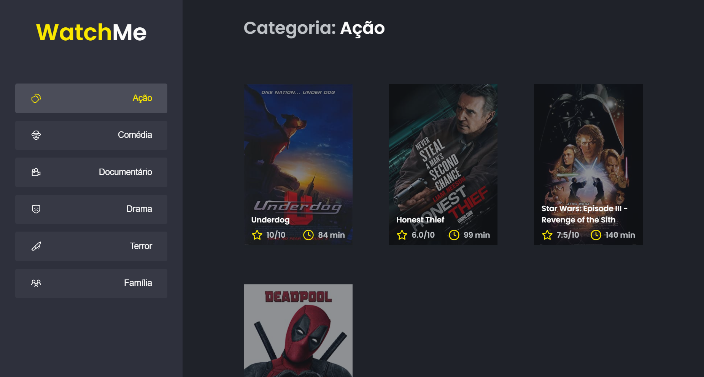

<h1 align="center">
    
    <p>Challenger 2 from bootcamp Ignite</p>
</h1>

<p align="center">
  

  

  <a href="https://github.com/dsbastos/nlw4-moveit-nextjs/">
    
  </a>

   
   <a href="https://github.com/dsbastos/Listagem-Filmes-Ignite/stargazers">
  </a>

  <a href="https://www.linkedin.com/in/daniel-bastos98/">
    
  </a>
</p>

<h4 align="center"> 
	 Status: Complete
</h4>

<p align="center">
 <a href="#about">About</a> •
 <a href="#layout">Layout</a> • 
 <a href="#tech">Tech</a> • 
 <a href="#author">Author</a> • 
 <a href="#user-content-license">License</a>

</p>

<h1 align="center">
    
</h1>

## 💻 About

---

## 🎨 Layout

<pd>
  
</p>

---

## 🛠️ Tech

The following tools were used in the construction of the project:

- **[Pure CSS3](https://developer.mozilla.org/en-US/docs/Web/CSS)**
- **[Javascript](https://developer.mozilla.org/pt-BR/docs/Web/JavaScript)**
- **[Typescript](https://www.typescriptlang.org/)**
- **[Reactjs](https://reactjs.org/)**

---

## Getting Started

First, run the development server:

```bash
yarn
yarn dev
yarn server
```

Open [http://localhost:3000](http://localhost:3000) with your browser to see the App.

---

## How to contribute

1. Fork the project.
2. Create a new branch with your changes: `git checkout -b my-feature`
3. Save your changes and create a commit message telling you what you did: `git commit -m" feature: My new feature "`
4. Submit your changes: `git push origin my-feature`

---

## Author

<a href="https://www.linkedin.com/in/daniel-bastos98/">
 
 <br />
 <sub><b>Daniel Bastos</b></sub></a> <a href="https://www.linkedin.com/in/daniel-bastos98/" title="Linkedin"></a>
 <br />

[](https://www.linkedin.com/in/daniel-bastos98/)

---

## License

This project is under the license [MIT](./LICENSE).
